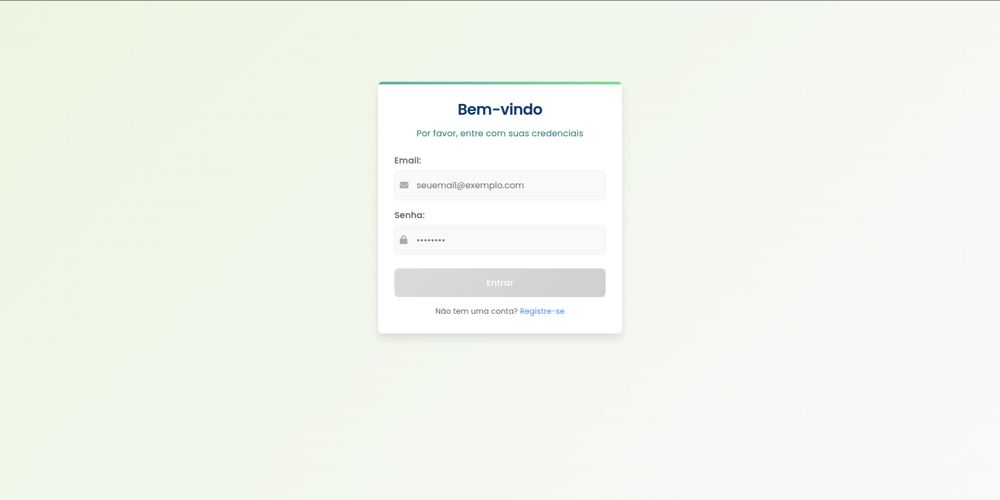
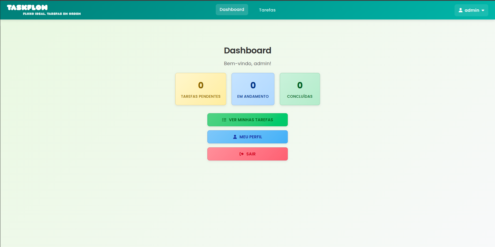

# 🚀 TaskFlow - Sistema de Gerenciamento de Tarefas

**Resumo:** O TaskFlow é uma aplicação web que permite aos usuários cadastrarem, visualizarem e gerenciarem tarefas com diferentes status e prioridades. A solução é composta por um frontend moderno em Angular e um backend robusto em FastAPI, integrando funcionalidades de autenticação, dashboard e persistência em banco de dados MySQL.

---

## 🎯 Objetivo

O projeto tem como objetivo principal desenvolver uma aplicação completa para gerenciamento de tarefas pessoais, permitindo organização e controle de produtividade. O sistema também explora conceitos fundamentais de desenvolvimento fullstack, autenticação com JWT, integração cliente-servidor e persistência de dados com ORM. O projeto está alinhado com os conteúdos práticos da disciplina de Desenvolvimento Web.

---

## 👨‍💻 Tecnologias Utilizadas

- Python 3.12
- FastAPI
- SQLAlchemy + Pydantic
- MySQL 8.0
- Angular 17+ (TypeScript)
- RxJS / Angular Router / Reactive Forms
- TailwindCSS
- JWT (JSON Web Token)
- HTML + CSS + JS

---

## 🗂️ Estrutura do Projeto

```
📦 taskflow-project
├── 📁 backend
│   ├── app/
│   │   ├── api/
│   │   │   └── v1/endpoints/
│   │   ├── core/
│   │   ├── crud/
│   │   ├── db/
│   │   ├── models/
│   │   ├── schemas/
│   │   └── main.py
│   ├── .env
│   └── requirements.txt
├── 📁 frontend
│   ├── src/app/
│   │   ├── components/
│   │   │   ├── dashboard/
│   │   │   ├── login/
│   │   │   ├── register/
│   │   │   ├── task-form/
│   │   │   └── task-list/
│   │   ├── guards/
│   │   ├── models/
│   │   ├── pages/
│   │   ├── services/
│   │   ├── shared/
│   │   ├── app.component.ts
│   │   └── app.routes.ts
│   └── angular.json
├── README.md
```

---

## ⚙️ Como Executar

### ✅ Rodando Localmente

1. Clone o repositório:

```
git clone https://github.com/Theeus7/taskflow-project
cd taskflow
```

2. Crie e ative o ambiente virtual (backend):

```
cd backend
python -m venv venv
source venv/bin/activate  # ou venv\Scripts\activate no Windows
```

3. Instale as dependências:

```
pip install -r requirements.txt
```

4. Configure o arquivo `.env` com os dados do banco de dados:

```
MYSQL_USER=seu_usuario
MYSQL_PASSWORD=sua_senha
MYSQL_HOST=localhost
MYSQL_PORT=3306
MYSQL_DB=taskflow
SECRET_KEY=sua_chave
```

5. Execute a API:

```
uvicorn app.main:app --reload
```

6. Em outro terminal, rode o frontend:

```
cd frontend
npm install
ng serve
```

---

## 📸 Demonstrações

- Tela de login com autenticação JWT
- Dashboard com estatísticas de tarefas
- Lista com filtros e formulário para cadastrar tarefas





---

## 👥 Equipe

|         Nome          |                   GitHub                                  | 
|-----------------------|-----------------------------------------------------------|
| Matheus Angelo        |[@theeus7](https://github.com/theeus7)                     |
| Fernando Junior       |[@fernandojsj](https://github.com/fernandojsj)             |
| Lucas Miguel          |[@LucasMiguelReis01](https://github.com/LucasMiguelReis01) |

---

## 🧠 Disciplinas Envolvidas

- Desenvolvimento Web
- Banco de Dados
- Programação Orientada a Objetos
- Engenharia de Software

---

## 🏫 Informações Acadêmicas

- Universidade: **Universidade Braz Cubas**
- Curso: **Ciência da Computação**
- Semestre: 3º
- Período: Noite
- Professora orientadora: **Dra. Andréa Ono Sakai**
- Evento: **Mostra de Tecnologia 1º Semestre de 2025**
- Local: Laboratório 12
- Datas: 05 e 06 de junho de 2025

---

## 📄 Licença

MIT License — sinta-se à vontade para utilizar, estudar e adaptar este projeto.